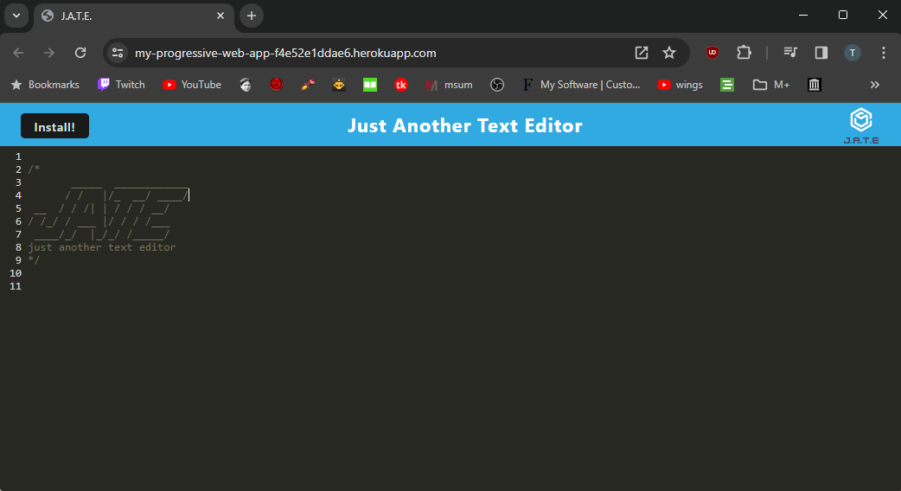

# Progressive Web Application

## Description

This project served as a way to become more familiar with Progressive Web Apps, or PWAs. How they work, what their uses are, and how to build them are all things that I learned about while working on this project. This project specifially works as a text editor that can be used in the browser, or downloaded an ran off the desktop. The text editer works both with and without an internet connection.

## Usage

To use this program, all you have to do is navigate to [this link.](https://my-progressive-web-app-f4e52e1ddae6.herokuapp.com/) From there, you will be able to use text editor as either a browser window, or you can click the "install" button to launch it as an app that runs off the desktop. 

Once the website has been initially loaded, it will continue to function regardless of internet connection status.

 

## Credits

This project was completed with the help of starter code provided by [Gary Almes](https://github.com/garytalmes)